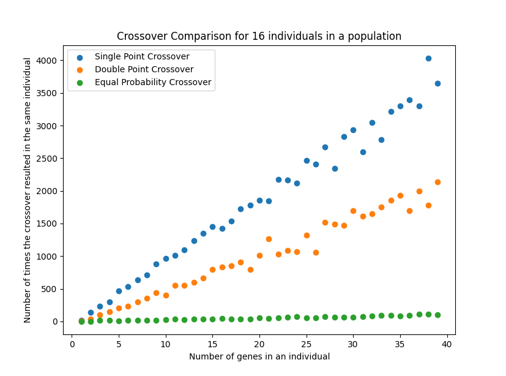
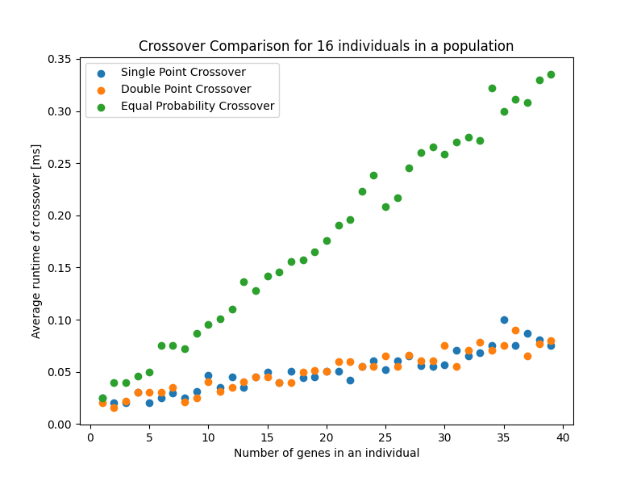
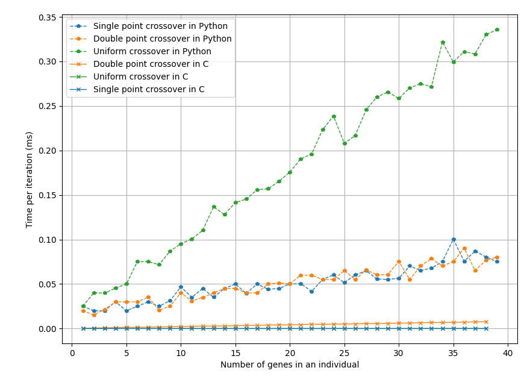
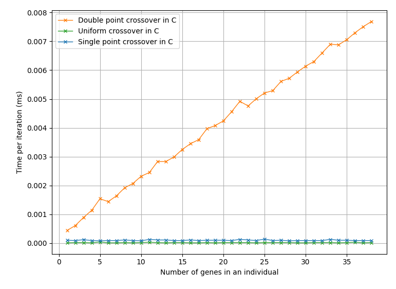
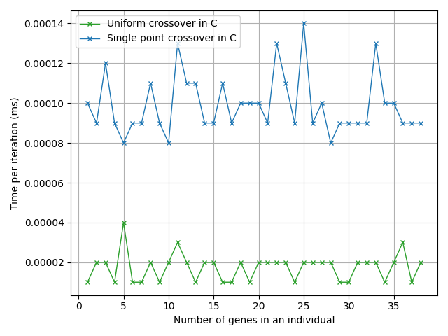

########
Crossing
########

The crossing of two binary individuals is a process that generates two new
individuals for the population and discarding the two parents. This can be done
in various ways this library has methods for the following:

 - Single point crossover
 - Two point crossover
 - Uniform crossover

Implementation of the crossing methods
****************************************

Single point crossover
======================

The single point crossover is the most common method of crossing. It takes two
individuals and a random point in the genome and swaps the genes after that
point between the two individuals. This is illustrated in the following figure:

Two point crossover
===================

The two point crossover is similar to the single point crossover, but instead
of swapping the genes after one point, it swaps the genes between two points.
This is illustrated in the following figure:

Uniform crossover
=================

The uniform crossover is a method that swaps the bits between two individuals
with a probability of 0.5 per bit inside the individual. This is illustrated
in the following figure:

Difference between the crossing methods
=======================================

The difference between the crossing methods can be classified by the amount
of similarity between the parents and the children. The single point crossover
and the two point crossover are similar in the sense that the children are
similar to the parents. The uniform crossover is different in the sense that
the children are not similar to the parents. This is illustrated in the
following figure:

The time complexity of the crossing methods is the same, since they all have
to loop over the genes in the genome. The space complexity is also the same,
since they all have to allocate a new array for the children.

A figure with the time complexity, in python, of the crossing methods can be
found below:

Differences between Python and C implementations
************************************************

The Python and C implementations of the crossing methods are very similar. The
main difference is that the C implementation requires the result array to be
preallocated, and the amount of genes with their respective bitsize to be
passed as arguments. The Python implementation does not require this and
returns a new array with the result.

Another difference is the speed of the implementations. The C implementation
is much faster than the Python implementation, a comparison of the speed can
be found in the following figure:

There is also a difference in between the time complexity of the three methods
in C, this is illustrated in the following figure:

With the fastest methods being uniform and single point crossover, and the
slowest method being the two point crossover. The figure below zooms in on the
fastest methods:

These interesting results are caused by the way the methods are implemented
in C and Python. The Python implementation of single and double point crossover
are vectorized, which means that they are implemented in a way that they can
be applied to the whole population at once. The uniform crossover is not
vectorized, which means that it is applied to each individual in the population
with an expensive for loop.

In C the double point crossover needs to make sure that the second point is
after the first point, which is done with an if statement. This if statement
is the cause of the double point crossover being slower than the single point
crossover. The uniform crossover is the fastest method in C, because it does
not need to check if the points are in the right order.

Crossing methods
****************

.. automodule:: dfmcontrol.Utility.crossover
   :members:
   :undoc-members:
   :show-inheritance: