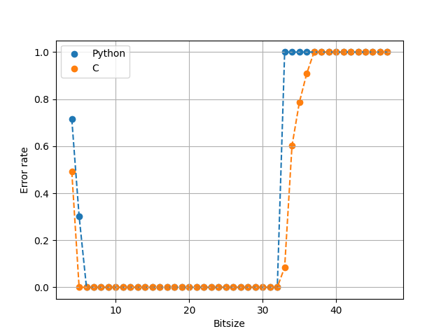
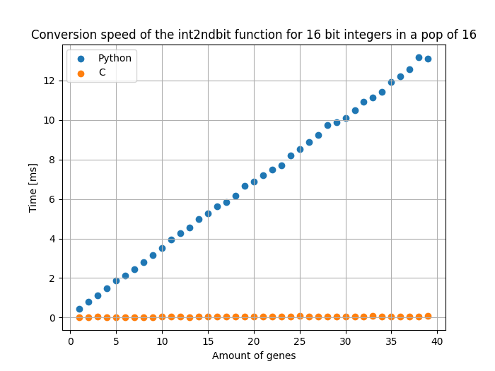
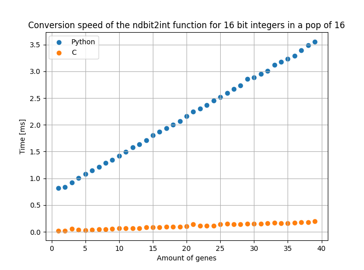
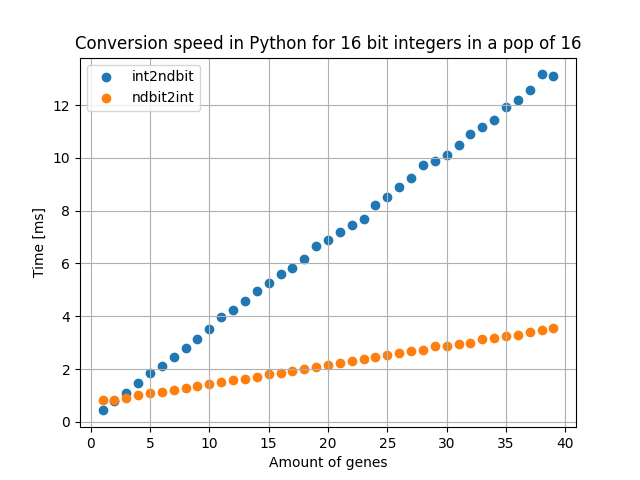
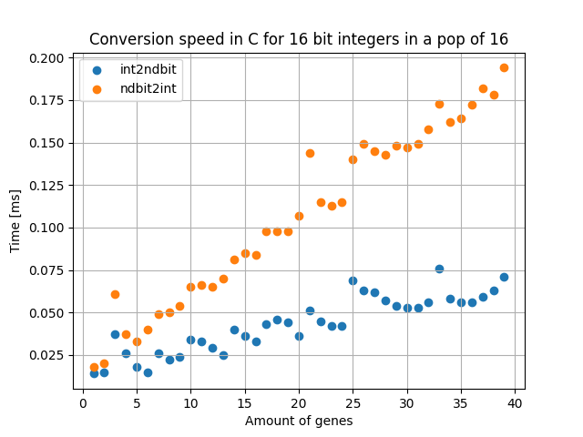

######
Helper
######

This file contains the helper functions used all over the library. It is
not intended to be used directly by the user but can be useful in certain
situations.

floating point conversion routines
**********************************
The floating point to binary (and back) conversions support
the IEEE 754 standard and custom method proposed in :ref:`here <Binary representation
>`. Both these functions are intended for n > 2 matrices of binary values but
support single array conversions.

Plotting routines
*****************
There is a function to plot 3d functions (like the ones provided in
:ref:`Tests functions <Tests functions>`), this function is called
:func:`plot3d` and supports all plotting routines for 3d plots provided by
matplotlib.

Various functions
*****************

Sigmoid
-------
The file also contains a function for the sigmoid function in its more
simple form and a version containing all the different variables used in
the sigmoid function. A derivative of the sigmoid function is also provided.

The simplified sigmoid function is called :func:`sigmoid` and is defined as,

.. math::
    f(x) = \frac{1}{1 + e^{-x}}.

The more complex version is called :func:`sigmoid2` with the following
definition,

.. math::
    f(x) = \dfrac{a + (b - a)}{1 + Q \cdot \left( \exp(-c \cdot (x -d) \right)^{1/nu}}.

The derivative of the sigmoid function is called :func:`sigmoid_derivative`.

Decorator test
--------------
The is_decorated function test if a function is decorated with a decorator.

Convertpop2bin
--------------
Converts a population of binary values to a population of integers.

When using C
************

This file is also included in the C library and is used to convert the 
integers to binary values and in reverse. The functions are called:

integer to binary

* :func:`int2bin`
* :func:`intarr2binarr`
* :func:`intmat2binmat`

binary to integer

* :func:`bin2int`
* :func:`binarr2intarr`
* :func:`binmat2intmat`

Furthermore, the more high level bin to float and float to bin functions are
also included in the C library. These functions are named like the python
functions and can both be used for integers and floats.

These functions include:

* :func:`ndbit2int`
* :func:`int2ndbit`

And use the same bias and factor parameters as the python functions to compute
the floating point values.

.. note:: The C library does not initialise arrays/matrices these should be
       initialised before calling the functions in the form of a value-array,
       the amount of genes/individuals/bitsize and a correctly sized result-array.
       The functions will not check if the result-array is correctly sized 
       and will overwrite any values in the result-array.

The C library also includes the sigmoid function and its derivative. These
functions are named as in the python library. The sigmoid functions operate
on arrays and are used in the same way as the conversion functions where it
is expected that the result-array is correctly sized.

Known errors
************

The conversion routines for ndbit2int and int2ndbit are prone to rounding
errors. This is due to the fact that the conversion routines use the
floating point representation of the integers. This means that the
conversion routines are not exact and can be off by a small amount.

These errors become very present when working with large bitsizes (>32 bits)
and when using small bitsizes (<4 bits). In C and python the error rates can
be found in the figure below.

Speed-up of the C library
*************************

Below is a graph showing the speed-up of the C library compared to the
python library for the conversion routines of the population as floats to
binary and back. The tests are done for 16 bits populations with a size of
16 individuals where the amount of genes is varied between 1 and 40. The
bias and factor are set to 0 and 5 respectively for the normalisation of the
integer to floating point values.

Floating point to binary conversion using int2ndbit:

Binary to floating point conversion using ndbit2int:

Below is a graph showing the routines in Python:

The difference between the two routines in C:

Helper functions in Python:
***************************
.. automodule:: dfmcontrol.Helper.helper
   :members:
   :undoc-members:
   :show-inheritance:

Helper functions in C:
**********************

.. c:function:: void int2bin(int *value, int *result, int bitsize)

    Convert an integer to a bitarray

    :param value: The integer to be converted to a bitarray
    :type value: int

    :param bitsize: is the size of the bitarray
    :type bitsize: int

    :param result: is the bitarray to be filled with the converted values
    :type result: array of ints (int *)

    :return: void

.. c:function:: void intarr2binarr(int *value, int *result, int bitsize, int size)

    Convert an array of integers to an array of bitarrays

    :param valarr: The array of integers to be converted to bitarrays (a)
    :type valarr: array of ints (int *)

    :param bitsize: The size of the bitarrays
    :type bitsize: int

    :param genes: The number of genes in the bitarrays (n = genes / bitsize; n = a / bitsize)
    :type genes: int

    :param result: The array of bitarrays to be filled with the converted values (n * bitsize)
    :type result: array of ints (int *)

    :return: void

.. c:function:: void intmat2binmat(int *value, int *result, int bitsize, int size)

    Convert a matrix of integers to a matrix of bitarrays (a x b) (individuals x genes)

    :param valmat: The matrix of integers to be converted to bitarrays (a x b) (individuals x genes)
    :type valmat: array of ints (int **)

    :param bitsize: The size of the bitarrays
    :type bitsize: int

    :param genes: The number of genes in the bitarrays (n = genes * bitsize; n = b * bitsize)
    :type genes: int

    :param individuals: The number of individuals in the bitarrays (m = individuals; m = a)
    :type individuals: int

    :param result: The matrix of bitarrays to be filled with the converted values (m x n)
    :type result: array of ints (int **)

.. c:function:: int bin2int(int *value, int bitsize)

    Convert a bitarray to an integer

    :param value: The bitarray to be converted to an integer
    :type value: array of ints (int *)

    :param bitsize: The size of the bitarray
    :type bitsize: int

    :return: The integer value of the bitarray
    :rtype: int

.. c:function:: void binarr2intarr(int *value, int *result, int bitsize, int size)

        Convert an array of bitarrays to an array of integers

        :param valarr: The array of bitarrays to be converted to integers (a)
        :type valarr: array of ints (int *)

        :param bitsize: The size of the bitarrays
        :type bitsize: int

        :param genes: The number of genes in the bitarrays (n = genes / bitsize; n = a / bitsize)
        :type genes: int

        :param result: The array of integers to be filled with the converted values (n)
        :type result: array of ints (int *)

        :return: void

.. c:function:: void binmat2intmat(int *value, int *result, int bitsize, int size)

    Convert a matrix of bitarrays to a matrix of integers (a x b) (individuals x genes)

    :param valmat: The matrix of bitarrays to be converted to integers (a x b) (individuals x genes)
    :type valmat: array of ints (int **)

    :param bitsize: The size of the bitarrays
    :type bitsize: int

    :param genes: The number of genes in the bitarrays (n = genes * bitsize; n = b * bitsize)
    :type genes: int

    :param individuals: The number of individuals in the bitarrays (m = individuals; m = a)
    :type individuals: int

    :param result: The matrix of integers to be filled with the converted values (m x n)
    :type result: array of ints (int **)

.. c:function:: void ndbit2int(int** valarr, int bitsize, int genes, int individuals,float factor, float bias, int normalised, float** result)

    Convert an integer matrix to a floating point value matrix normalized by a bias and factor
    or to an integer matrix (of type float**) with integers between
    -2^bitsize and 2^bitsize - 1.

    :param valarr: The matrix of integers to be converted to floating point values (a x b) (individuals x genes)
    :type valarr: array of ints (int **)

    :param bitsize: The size of the bitarrays
    :type bitsize: int

    :param genes: The number of genes in the bitarrays (n = genes * bitsize; n = b * bitsize)
    :type genes: int

    :param individuals: The number of individuals in the bitarrays (m = individuals; m = a)
    :type individuals: int

    :param factor: The factor to be used for the conversion
    :type factor: float

    :param bias: The bias to be used for the conversion
    :type bias: float

    :param normalised: If 1, the values are normalized by the bias and factor, if 0, the values are not normalized
    :type normalised: int

    :param result: The matrix of floating point values to be filled with the converted values (m x n)
    :type result: array of floats (float **)

    :return: void

.. c:function:: void int2ndbit(float** valarr, int bitsize, int genes, int individuals,float factor, float bias, int normalised, int** result)

    Convert a floating point value matrix normalized by a bias and factor or an integer matrix
    (of type float**) with integers between -2^bitsize and 2^bitsize - 1 to
    an integer matrix of binary arrays.

    :param valarr: The matrix of floating point values to be converted to integers (a x b) (individuals x genes)
    :type valarr: array of floats (float **)

    :param bitsize: The size of the bitarrays
    :type bitsize: int

    :param genes: The number of genes in the bitarrays (n = genes * bitsize; n = b * bitsize)
    :type genes: int

    :param individuals: The number of individuals in the bitarrays (m = individuals; m = a)
    :type individuals: int

    :param factor: The factor to be used for the conversion
    :type factor: float

    :param bias: The bias to be used for the conversion
    :type bias: float

    :param normalised: If 1, the values are normalized by the bias and factor, if 0, the values are not normalized
    :type normalised: int

    :param result: The matrix of integers to be filled with the converted
                    values (m x n) (individuals x genes * bitsize)
    :type result: array of ints (int **)

.. c:function:: void sigmoid(float *value, float *result, int size)

        Calculate the sigmoid of an array of floats

        :param value: The array of floats to be converted to sigmoid values (a)
        :type value: array of floats (float *)

        :param size: The size of the array
        :type size: int

        :param result: The array of floats to be filled with the converted values (a)
        :type result: array of floats (float *)

        :return: void

.. c:function:: void sigmoid_derivative(float *value, float *result, int size)

            Calculate the sigmoid derivative of an array of floats

            :param value: The array of floats to be converted to sigmoid derivative values (a)
            :type value: array of floats (float *)

            :param size: The size of the array
            :type size: int

            :param result: The array of floats to be filled with the converted values (a)
            :type result: array of floats (float *)

            :return: void

.. c:function:: void sigmoid2(float* x, float a, float b, float c, float d, float Q, float nu ,float* result, int size)

    Calculate the sigmoid of an array of floats

    .. math::
        f(x) = \dfrac{a + (b - a)}{1 + Q \cdot \left( \exp(-c \cdot (x -d) \right)^{1/nu}}

    :param x: The array of floats to be converted to sigmoid values (a)
    :type x: array of floats (float *)

    :param a: The a parameter of the sigmoid function
    :type a: float

    :param b: The b parameter of the sigmoid function
    :type b: float

    :param c: The c parameter of the sigmoid function
    :type c: float

    :param d: The d parameter of the sigmoid function
    :type d: float

    :param Q: The Q parameter of the sigmoid function
    :type Q: float

    :param nu: The nu parameter of the sigmoid function
    :type nu: float

    :param size: The size of the array
    :type size: int

    :param result: The array of floats to be filled with the converted values (a)
    :type result: array of floats (float *)

    :return: void

