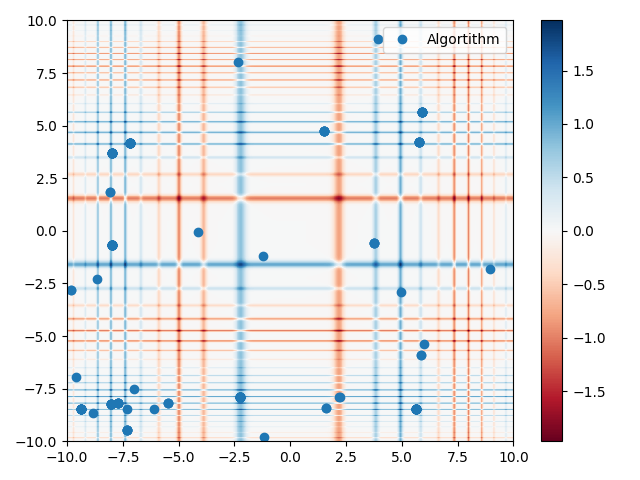
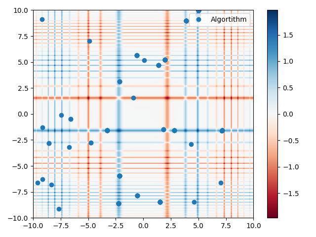
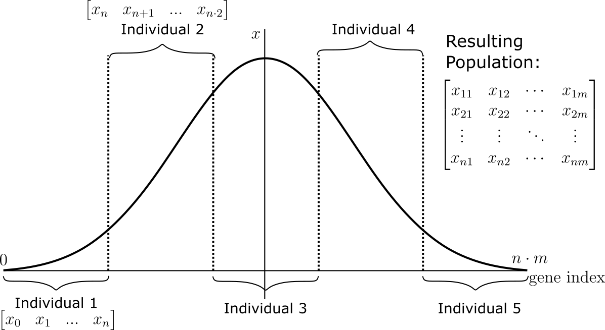
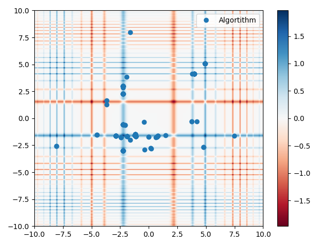
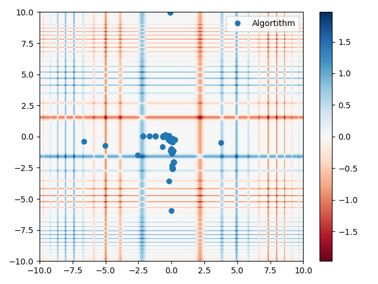

##########
Population
##########

The population of the genetic algorithm is defined by an 2 dimensional array
of individuals. Each individual is represented by a 1 dimensional array of
genes. The number of genes in each individual is defined by the number of
variables in the problem. The number of individuals in the population is
defined by the population size. The population size is a parameter of the
algorithm. The population size is the number of individuals in the population
at any given time.

Population initialisation methods
*********************************

Withing the genetic algorithm, the population is initialised using a
population initialisation method. Included in the library are a number of
methods that follow the same template.

All methods return a 2 dimensional array of individuals. Each individual is
represented by a 1 dimensional array of genes. The number of genes in each
individual is defined by the number of variables in the problem. A gene has a
length of the bitsize of the variable.

.. note::

   The binary to decimal conversion is done by the ndbit2int and int2ndbit
   methods these contain rounding errors for large bitsizes (>32) and small
   sizes (<4). For larger bitsizes the user should provide their own methods.

Random population initialisation
================================

The random population initialisation method initialises the population with
random values of 0s and 1s. This method is the most simple method of
initialising the population and provides no information about the problem.

To compute an individual the following equation is used:

.. math::

   x = rand(0, 2)

Where :math:`x` is the gene value and :math:`rand` is a random number between
0 and 2.

These values are computed for the length of the individual. And stacked for the
amount of individuals in the population resulting in the population matrix.

A two-dimensional representation of the population on the michealwicz function
is shown below.

   Random population initialisation on the michealwicz function.

Uniform population initialisation
=================================

The uniform population initialisation method initialises the population with
uniformly distributed values between the lower and upper bounds of the
variables. This method provides a boundary for values generated for the
population. The floating point values can be bounded by using the
:attr:`factor` and :attr:`bias` parameters.

Within the input space the following probability density function is defined to
find values for the population:

.. math::

   f(x) = \begin{array}{lcl}
            \frac{1}{b - a} & \text{for} & a \leq x \leq b \\
            0 & \text{for} & x < a \text{ or } x > b
            \end{array}

Where :math:`f(x)` is the probability density function, :math:`b` is the upper
bound, :math:`a` is the lower bound and :math:`x` is the value of the gene.

To compute an individual the following equation is used:

.. math::

   x = rand(a, b)

Where :math:`x` is the gene value and :math:`rand` is a random number between
the lower and upper bounds. These values are stacked into a matrix for the
amount of individuals in the population and converted to binary using the
:func:`int2ndbit` method with the :attr:`factor` and :attr:`bias` parameters.

The figure below shows a two-dimensional representation of the population on
the michealwicz function.

   Uniform population initialisation on the michealwicz function.

Gaussian population initialisation
==================================

The gaussian population initialisation method initialises the population with
normally distributed values with a location parameter of the mean and a scale
parameter of the standard deviation. This method provides a boundary for values
generated for the population. The floating point values can be bounded by using
the :attr:`factor` and :attr:`bias` parameters.

Within the input space the following probability density function is defined to
find values for the population:

.. math::

   f(x) = \frac{1}{\sigma \sqrt{2 \pi}} e^{-\frac{(x - \mu)^2}{2 \sigma^2}}

Where :math:`f(x)` is the probability density function, :math:`\sigma` is the
standard deviation, :math:`\mu` is the mean and :math:`x` is the value of the
gene.

To retain the normal distribution on the population the normally distributed
values are "split" into m parts (the amount of individuals in the
population) and then stacked into a matrix. This process is visualised in the
figure below.

   The cutting of the normal distribution into m parts for the population.

Each part consists out of n genes (the amount of variables in the problem).
The matrix is then converted to binary using the :func:`int2ndbit` method with
the :attr:`factor` and :attr:`bias` parameters.

The figure below shows a two-dimensional representation of the population on
the michealwicz function.

   Gaussian population initialisation on the michealwicz function.

Cauchy population initialisation
================================

The cauchy population initialisation method initialises the population with
cauchy distributed values with a location parameter of the mean and a scale
parameter of the standard deviation. This method provides a boundary for values
generated for the population. The floating point values can be bounded by using
the :attr:`factor` and :attr:`bias` parameters.

Within the input space the following probability density function is defined to
find values for the population:

.. math::

   f(x) = \frac{1}{\pi \gamma \left[ 1 + \left( \frac{x - \mu}{\gamma} \right)^2 \right]}

Where :math:`f(x)` is the probability density function, :math:`\gamma` is the
scale parameter, :math:`\mu` is the location parameter and :math:`x` is the
value of the gene.

The population is generated in the same way as the gaussian population to retain
the cauchy distribution. The figure below shows a two-dimensional
representation of the population on the michealwicz function.

   Cauchy population initialisation on the michealwicz function.

Differences between Python and C methods
****************************************

Python methods for population initialisation
********************************************

Below are the library provided population initialisation methods. These
methods are used to initialise the population of the genetic algorithm.

.. automodule:: dfmcontrol.Utility.pop
   :members:
   :undoc-members:
   :show-inheritance:

C methods for population initialisation
***************************************

