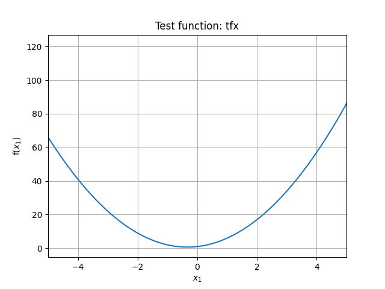
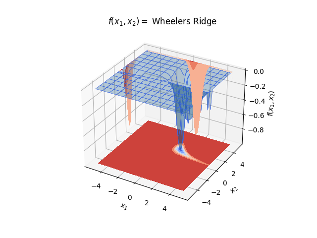
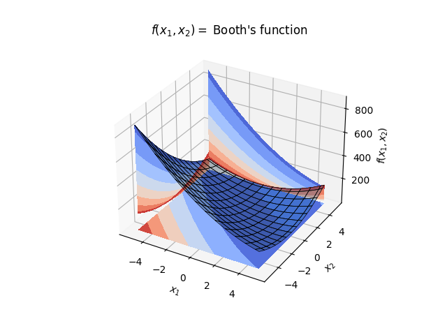
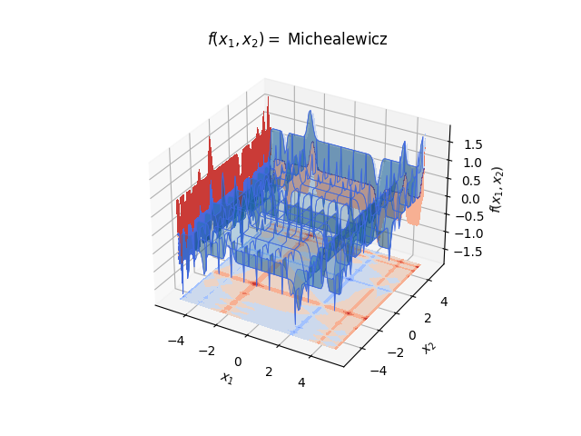
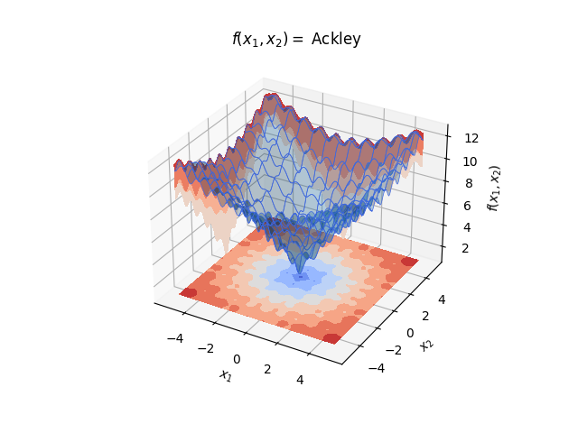
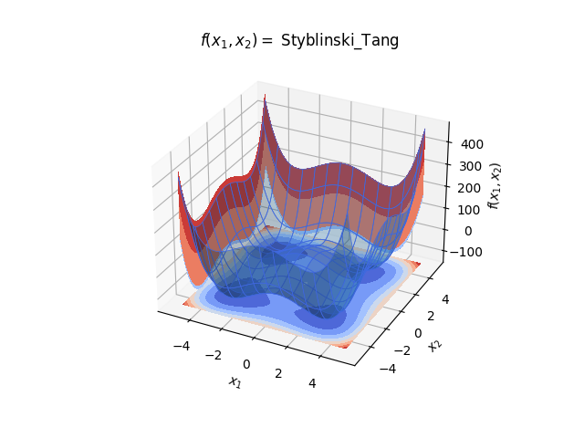

###########################
Mathematical test functions
###########################

This library contains a number of mathematical test functions to test the
convergence of optimization algorithms. The functions are taken from the
following sources:
 - simone fraser university :ref:`http://www.sfu.ca/~ssurjano/optimization.html` [1]
 - Algorithms for Optimization by Mykel J. Kochenderfer & Tim A. Wheeler [2]
 - Certified global minima for a benchmark of difficult optimization problems [3]

The functions are implemented in the :mod:`test_functions` module.

.. [1] S. Fraser, "Test functions for optimization algorithms," 2013.
.. [2] M. J. Kochenderfer & T. A. Wheeler, "Algorithms for Optimization," 2013.
.. [3] "Certified global minima for a benchmark of difficult optimization problems," 2013.

Functions
#########

1-d functions
=============

tfx
---
.. py:function:: test_functions.tfx(x)

    1-d Parabolic test function.
   :param x: Input value
   :type x: np.ndarray or list[float]
   :return: Value f(x1, x2, ....), real float
   :rtype: np.ndarray or float

2-d functions
=============

wheelers ridge
--------------
.. py:function:: test_functions.wheelers_ridge(x:Union[np.ndarray, list], a:float = 1.5)

    2-d Wheelers ridge test function.
   :param x: Input value
   :type x: np.ndarray or list[float]
   :return: Value f(x1, x2), real float
   :rtype: np.ndarray or float

booths function
---------------
.. py:function:: dfmcontrol.test_functions.t_functions.tfx(x)

    2-d Booths function test function.
   :param x: Input value
   :type x: np.ndarray or list[float]
   :return: TValue f(x1, x2), real float
   :rtype: np.ndarray or float

n-d functions
=============

michealewicz
------------

.. py:function:: test_functions.michealewicz(x: list, m: float = 10.0) -> float:

    n-d test function with many local minima.

   :param x: List of x inputs, where N-dimensions = len(x)
   :param m: Steepness parameter, typically m=10
   :type x: np.ndarray or list[float]
   :type m: float
   :return: Value f(x1, x2, ....), real float
   :rtype: np.ndarray or float

Ackley
------

.. py:function:: test_functions.ackley(x: list, a: float = 20.0, b: float = 0.2, c: float = 2.0 * np.pi) -> float:

    n-d test function with a single global minimum.

   :param x: List of x inputs, where N-dimensions = len(x)
   :param a: Steepness parameter, typically a=20
   :param b: Steepness parameter, typically b=0.2
   :param c: Steepness parameter, typically c=2*pi
   :type x: np.ndarray or list[float]
   :type a: float
   :type b: float
   :type c: float
   :return: Value f(x1, x2, ....), real float
   :rtype: np.ndarray or float

Styblinski Tang
---------------

.. py:function:: test_functions.styblinski_tang(x: list) -> float:

    n-d test function 3 local minima and a global minimum.

   :param x: List of x inputs, where N-dimensions = len(x)
   :type x: np.ndarray or list[float]
   :return: Value f(x1, x2, ....), real float
   :rtype: np.ndarray or float

Decorator function
##################

.. automodule:: dfmcontrol.Mathematical_functions.t_functions
   :members:
   :undoc-members:
   :show-inheritance:
